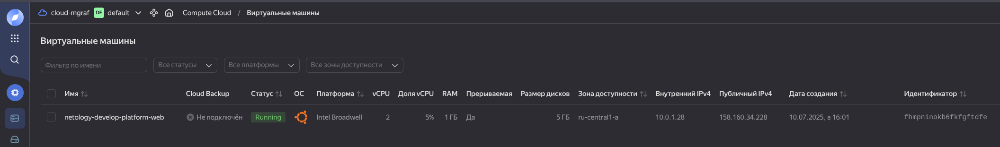
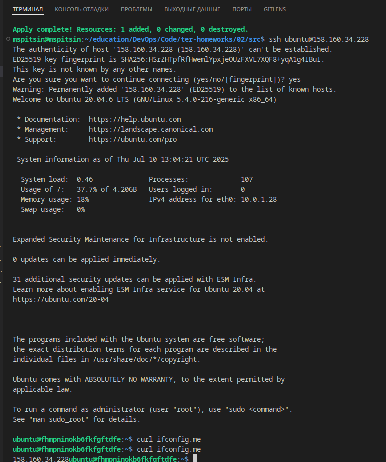
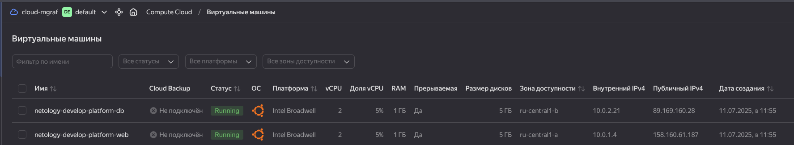
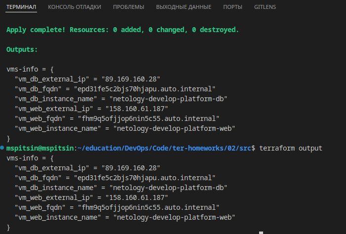
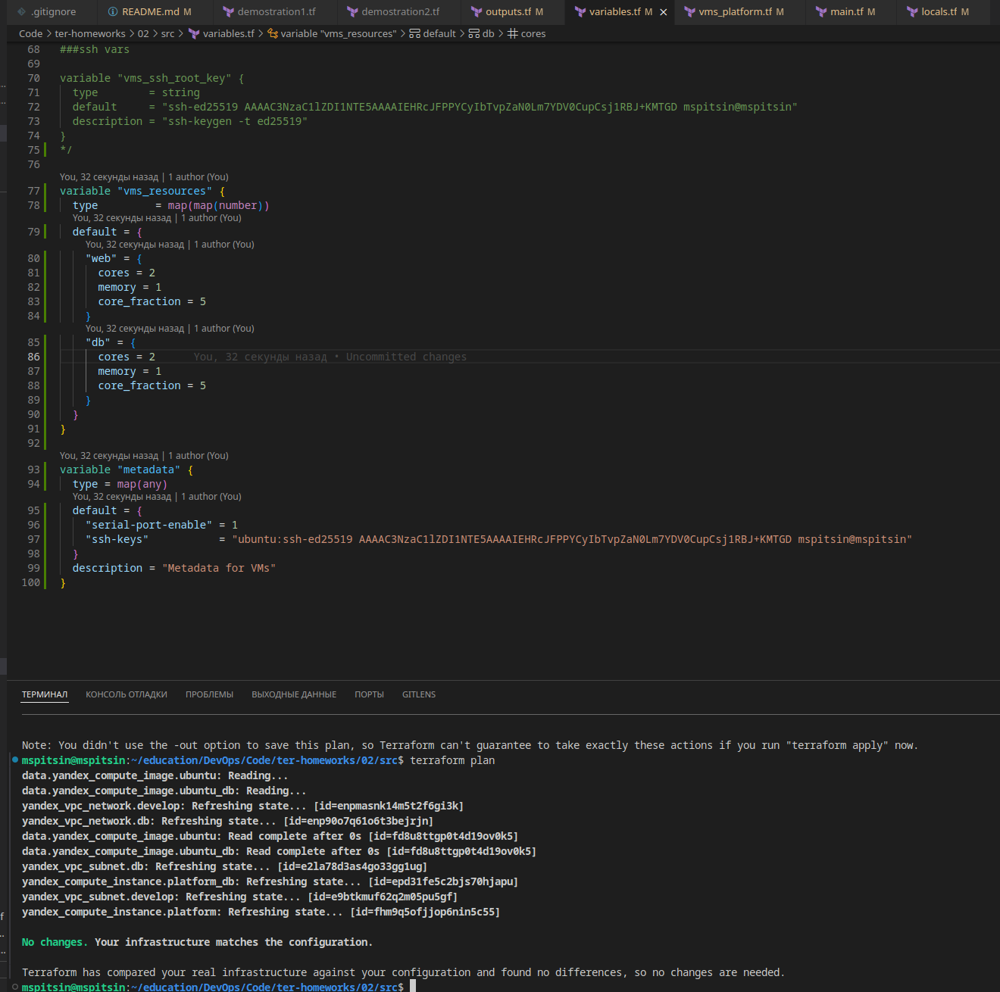

# Домашнее задание к занятию «Основы Terraform. Yandex Cloud»

## Решение задания 1  
- скриншот ЛК Yandex Cloud с созданной ВМ, где видно внешний ip-адрес  
    
    
- скриншот консоли, curl должен отобразить тот же внешний ip-адрес  
    

###  Ошибки: 
  - В блоке кода `resource "yandex_compute_instance" "platform"` не правильно задан параметр `platform_id = "standart-v4"`, должно быть: `standard`, версия `v4` неправильная.  
   Согласно документации Yandex.Cloud (https://cloud.yandex.ru/docs/compute/concepts/vm-platforms) версии платформы могут быть только: `standard-v1`, `standard-v2`, `standard-v3` и `amd-v1`  
  -  В том же блоке кода, в строке `cores = 1` указано неправильное количество ядер процессора.  
  Согласно документации Yandex.Cloud (https://cloud.yandex.ru/docs/compute/concepts/performance-levels) для платформы Intel Broadwell (standard-v1) значение колличества ядер должно быть от 2 до 32.  

### Ответы:
- Параметр `preemptible = true` делает ВМ **прерываемой** — позволяет останавливать её в любой момент. Это может быть полезно, если с момента запуска машины прошло 24 часа либо возникает нехватка ресурсов для запуска ВМ. Прерываемые ВМ не обеспечивают отказоустойчивость.  
- Параметр `core_fraction=5` указывает базовую производительность ядра в процентах. Указывается для экономии ресурсов. Например, если нужно снизить затраты на содержание ВМ, можно указать, что базовый процент использования CPU — 5.  
  
## Решение задания 2  
Решение в [коде](src/) проекта.

## Решение задания 3  
  

## Решение задания 4  
  

## Решение задания 5  
```yaml
##locals.tf

locals {
  project = "netology-develop-platform"
  type_web = "web"
  type_db  = "db"
  vm_web_instance_name = "${local.project}-${local.type_web}"
  vm_db_instance_name  = "${local.project}-${local.type_db}"
}
```  
```yaml
#main.tf

resource "yandex_compute_instance" "platform_db" {
  name        = local.vm_db_instance_name
  ...
  }
```
## Решение задания 6  
